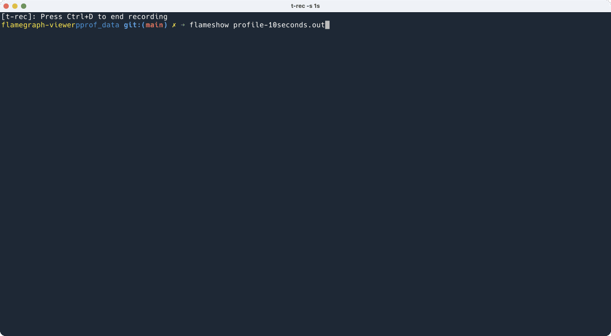

# Flameshow

<a href="https://badge.fury.io/py/flameshow"></a>

Flameshow is a terminal Flamegraph viewer.



## Features

- Renders Flamegraphs in your terminal
- Supports zooming in and displaying percentages
- Keyboard input is prioritized
- However, all operations in Flameshow can also be performed using the mouse
- Can switch to different sample types

## Install

```shell
pip install flameshow
```

Requirements: needs `go` command available for building `.so` file for Golang.

(`.whl`s are on the way!)

## Usage

View golang's goroutine dump:

```shell
$ curl http://localhost:9100/debug/pprof/goroutine -o goroutine.out
$ flameshow goroutine.out
```

Once you open flameshow, you should be able to use it, the UI is very easy to
use.

Currently it only supports Golang's pprof dump, I am working on supporting more
formats
